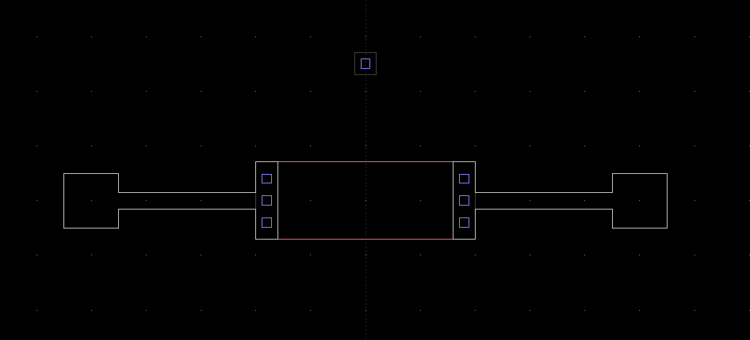
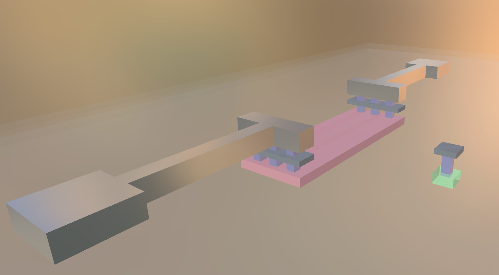

**Text-Based Hardware Design Language**  `.hw`

[]()
[]()
[]()

---

## What is Hardware Script?

Hardware Script (`.hw`) is a **Turing-complete, compile-time generative hardware description language** that compiles to industry-standard formats. Write PCB layouts and silicon IC designs as human-readable, Git-friendly text files — then compile to SPICE netlists, Gerber files, DXF drawings, GDSII, BOM, and 3D models.

The compiler (`hwc`) is written in Rust and built for picometer-precision physical synthesis. In v0.3.0 the language crossed a threshold: layout is no longer just declarative markup. A **Linear Bytecode Virtual Machine (`hwc-eval`)** runs real programs at compile time — functions, loops, structs, `match`, and dimensional math — emitting geometry into a deterministic entity graph *before* any synthesis or routing begins. It works at every scale, from millimeter PCBs to nanometer silicon chiplets, using the same language.

---

## A Complete Example

### 1. Pure comptime computation (`hwc eval` / `hwc run`)

A `.hw` file can be a plain compute script. No board, no meshing — just the compile-time evaluation engine:

```hw
# ohm_calc.hw
import * from @std/primitives/units
import * from @std/primitives/math

fn main() {
    # 1. Pure integer arithmetic
    let a = 1
    let b = 1
    println("Basic Math: 1 + 1 = {a + b}")

    # 2. Physical dimensional algebra (128-bit picometer integers)
    let length   = 4.0um
    let width    = 1.41um
    let sheet_r  = 350.0            # Ohm per square
    let r_body   = (length / width) * sheet_r
    println("R_body for (4um / 1.41um) = {r_body} Ohms")

    # 3. Standard built-ins (sqrt, min, max, abs)
    println("hypot(3,4) = {sqrt(3.0 * 3.0 + 4.0 * 4.0)}")
    println("min(100nm, 50nm) = {min(100nm, 50nm)}")

    # 4. Loops in pure compute
    for i in 0..5 {
        let offset = i * 400nm
        println("  Via #{i}: offset = {offset}")
    }
}
```

```bash
hwc run ohm_calc.hw
# Basic Math: 1 + 1 = 2
# R_body for (4um / 1.41um) = 990.01 Ohms
# hypot(3,4) = 5
# min(100nm, 50nm) = 50nm
#   Via #0: offset = 0nm
#   Via #4: offset = 1600nm
```

### 2. Generative IC layout (SKY130 CMOS inverter)

Real layout is *computed*. This is a complete, valid v0.3.0 source — a CMOS inverter built from parametric PDK PCells in `@std/pdk/sky130`:

```hw
# cmos_inverter.hw
import { sky130_nmos, sky130_pmos, sky130_tap, pad, route_strap } from @std/pdk/sky130
import * from @std/primitives/units

module CMOS_Inverter {
    pins: [input In, output Out, power VDD, ground VSS]
}

space CMOS_Inverter_Space implements CMOS_Inverter {
    dimensions: [20.0um, 18.0um]
    profile: SKY130_1V8_CMOS

    nets {
        VDD: { classification: power,   potential: 1.8V, current: 20.0uA }
        VSS: { classification: ground,  potential: 0.0V, current: 20.0uA }
        In:  { classification: signal,  potential: 1.8V, current: 0.1uA }
        Out: { classification: signal,  current: 20.0uA }
    }

    # Parametric PDK PCell: stamps diff/poly/contact geometry for us
    let nmos = sky130_nmos(
        name: "M_NMOS", W: 1.0um, L: 150nm, at: [10.0um, 5.0um],
        source: VSS, drain: Out, gate: In, bulk: VSS
    )

    let pmos = sky130_pmos(
        name: "M_PMOS", W: 2.0um, L: 150nm, at: [10.0um, 10.5um],
        source: VDD, drain: Out, gate: In, bulk: VDD
    )

    # Compiler-driven routes (DOPHR fills the physical path)
    route sub_tap.port to nmos.source { intent: Power }
    route well_tap.port to pmos.source { intent: Power }
}

test CMOS_Inverter_VTC_Test for CMOS_Inverter_Space {
    dc:   { sweep: In, start: 0.0V, stop: 1.8V, step: 0.02V }
    tran: { step: 5ps, stop: 10ns }
}
```

**Compiles to** (from that single source file):

| Output | File |
|--------|------|
| SPICE circuit netlist | `circuit.sp` |
| DC operating point | `dc.sp` |
| AC frequency sweep | `ac.sp` |
| Transient analysis | `tran.sp` |
| Bill of Materials | `bom.csv` |
| 2D mechanical drawing | `board.dxf` |
| Gerber X3 + Excellon | `*.gbr`, `*.drl` |
| GDSII (silicon IC) | `*.gds` |
| 3D model | `*.glb` |

### Visual Output Examples

**2D Layout View:**



**3D Model View:**



---

## The File System

Hardware Script uses exactly **three file extensions**:

| Extension | Purpose |
|-----------|---------|
| `hw.toml` | Project manifest  name, version, targets, dependencies |
| `hw.lock` | Deterministic lockfile  binary `rkyv` format, zero-copy loads |
| `.hw` | Universal source  materials, profiles, devices, modules, spaces, tests, and comptime functions |

Everything lives in `.hw` files. There is no separate schematic format, no separate layout format.

---

## Core Language Concepts

### `space`  Physical Layout

A `space` is a physical design region. It declares dimensions, a stackup profile, nets, and geometry (emitted by comptime code):

```hw
space My_Board implements Amplifier {
    dimensions: [20mm, 20mm]
    profile: StandardPCB
    nets { ... }
    # geometry emitted here via space.add_* or PCell calls
}
```

### `module`  Logical Interface

A `module` declares the logical schematic contract that a `space` must fulfill.

```hw
module Amplifier {
    pins: [input VIN, power VDD, ground GND, output VOUT]
}

space Amp_Layout implements Amplifier {
    ...
}
```

### `material`  Physical Properties

```hw
export material Polysilicon {
    category: conductor
    symbol: Poly
    properties {
        resistivity: 7e-5ohm_m
        thermal_conductivity: 30.0W_mK
        max_current_density: 1e2A_mm2
    }
}
```

### `profile`  Stackup Definition

A `profile` defines the physical layer stackup, via rules, trace constraints, and thermal limits. You reference it in a `space`.

```hw
export profile Resistor_3D {
    technology: "ASIC"
    substrate_net: GND
    stackup {
        pdiff:   [material: P_Plus_Diffusion, thickness: 200nm, routable: true]
        polyres: [material: Polysilicon,       thickness: 180nm, routable: true]
        li1:     [material: Titanium_Silicide, thickness: 100nm, routable: true]
        metal1:  [material: Aluminum,          thickness: 360nm, routable: true]
    }
    via {
        min_diameter: 170nm
        min_spacing: 200nm
    }
    trace {
        min_width: 300nm
        min_spacing: 300nm
    }
    thermal {
        ambient_temp: 25C
        max_operating_temp: 125C
    }
}
```

### `device`  Multi-Terminal Components

A `device` declares the contract for a multi-terminal physical structure (resistor, capacitor, MOSFET). Unlike a plain pour (single net), a device lets different nets meet through physics.

```hw
export device Resistor {
    terminals: [A, B, BULK]
    materials {
        A: [Polysilicon, Titanium_Silicide, Aluminum]
        B: [Polysilicon, Titanium_Silicide, Aluminum]
        BULK: [Air, P_Plus_Diffusion]
    }
    spice {
        prefix: X
        subcircuit: sky130_fd_pr__res_high_po
        terminal_order: [A, B, BULK]
        parameters: [W, L]
        parameter_style: named
    }
}
```

Geometry is bound to device terminals via the terminals of a PCell call or `space.add_device`.

### `subcircuit`  PDK Circuit Models

PDK-provided SPICE subcircuits are declared natively in `.hw` files. The compiler emits them verbatim into the generated `.sp` netlist:

```hw
export subcircuit sky130_fd_pr__res_high_po {
    terminals: [A, B, BULK]
    parameters: [W = 1.0um, L = 1.0um]
    elements {
        R_head: Resistor(nodes: [A, node_1], value: 362.0ohm)
        R_tail: Resistor(nodes: [node_2, B], value: 362.0ohm)
        R_body: Resistor(nodes: [node_1, node_2], value: 350.0ohm * (L / W))
    }
}
```

### Emitting Geometry: `space.add_*`

In v0.3.0, physical geometry is *emitted* by comptime code through native space methods (compiled to `EmitPolygon` / `EmitContact` / `EmitDevice` VM opcodes). All `space.add_*` calls accept an optional `name:` so generated shapes get stable names in the BOM/SPICE/DXF.

```hw
# A filled rectangular pour on a named layer
space.add_polygon(
    layer: "metal1",
    rect:  [5.0um, 5.0um, 1.0um, 1.0um],   # x, y, w, h
    net:   In,
    name:  "In_Pad"
)

# A via bridging two layers
space.add_contact(
    from: "polyres", to: "li1",
    at: [10.0um, 5.0um],
    diameter: 170nm,
    net: In,
    name: "Via_A"
)

# A multi-terminal device
space.add_device(
    type: "Resistor",
    name: "R1",
    terminals: { A: In, B: Out, BULK: GND },
    params:   { W: 1.41um, L: 3.20um }
)
```

`rect:` takes `[x, y, w, h]`; `points:` takes an explicit polygon vertex list (`[Point2D, ...]`). Both resolve to 64-bit picometer coordinates at compile time.

### `route`  Signal Routing

Routes connect named geometry. The compiler's DOPHR router calculates the physical trace path.

```hw
route In_Pad to Contact_A_Metal {
    net: In
    width: 300nm
    layer: metal1
    intent: Signal
}
```

### `test`  SPICE Testbenches

A `test` block configures SPICE analysis types for a space. The compiler automatically generates one `.sp` file per analysis type.

```hw
test Simple_Resistor_AC_Test for Simple_Resistor_Space {
    ac:   { sweep: dec, points: 20, freq: 100Hz..100MHz }
    tran: { step: 10ps, stop: 200ns }
}
```

---

## The Comptime Evaluation Engine (`hwc-eval`)

Hardware Script v0.3.0 is a **generative** language: layout logic runs *as a program* at compile time.

```
.hhw source ──▶ Lexer (logos) ──▶ Parser (Pratt, arena AST)
                           │
                           ▼
                 BytecodeCompiler  ──▶  Chunk { code: [OpCode], constants, spans }
                           │
                           ▼
                 VM  (Linear register VM, static activation records, sandboxed)
                           │  EmitPolygon / EmitContact / EmitDevice / EmitRoute
                           ▼
                 EntityGraph  (hwc-engine)  ──▶  DOPHR routing + physics  ──▶  exports
```

Key properties:

- **Linear Bytecode VM** — `eval/vm.rs` executes a flat `Chunk` of `OpCode`s on a register stack with static activation records. 86-instruction ISA (`eval/opcodes.rs`): arithmetic, comparison, bitwise/shift, jumps, `Call`/`Return`, arrays/structs, `CoercePoint2D`, and the four native `Emit*` opcodes.
- **128-bit picometer arithmetic** — every length/voltage/current/resistance is an `i128` scaled to a canonical internal unit (`MeasurementValue { raw: i128, dimension }`). Dimensional algebra is enforced: `Length × Length → Area`, `Voltage × Current → Power`, `Current × Resistance → Voltage`. Mismatched units are a compile-time error.
- **Hermetic sandbox** — `MAX_EVAL_STEPS = 10_000_000`, `MAX_RECURSION_DEPTH = 256`. Guarantees termination (Halting-Problem guard) and bounds compute scripts.
- **Dual-mode CLI** — `hwc eval "<expr>"|<file>` and `hwc run <file>` execute pure comptime scripts in <5 ms with zero meshing; `hwc build` runs the full synthesis + DOPHR + export pipeline.
- **Bit-identical output** — integer picometer math means the same `.hw` produces byte-identical GDSII/GLB across Windows/Linux/macOS.

### Built-in functions

`println`, `eprintln`, `dbg`, `assert`, `min`, `max`, `abs`, `sqrt`, `sin`, `cos`, `tan`, `rect_between`, `range`, `int`, `float`, `bbox_intersects`, `bbox_union`, `bbox_from_rect`.

---

## Generative Language Surface (v0.3.0)

### Functions, structs, enums, `match`

```hw
fn sheet_resistance(length: Measurement, width: Measurement, rsq: Float) -> Float {
    (length / width) * rsq
}

struct Pad { x: Measurement, y: Measurement, net: Net }

enum TapType { P_Sub, N_Well }

fn choose_tap(t: TapType) -> String {
    match t {
        TapType.P_Sub  => "tap_p"
        TapType.N_Well => "tap_n"
        _              => "tap_x"
    }
}
```

### Expression-oriented control flow

`if` and `match` are expressions; blocks evaluate to their tail; loops support `break`/`continue`:

```hw
let r = if flag { 42 } else { 0 }

let mut sum = 0
for i in 0..10 {
    if i == 3 { continue }
    if i == 7 { break }
    sum += i
}
assert(sum == 18)
```

### Arrays, tuples, and string interpolation

```hw
let mut arr = [1, 2, 3]
arr.push(4)
assert(arr[3] == 4)
assert(arr[1..3].len() == 2)

let (first, second) = (10, 20)

println("R = {r_body} Ohms  via #{i}")
```

### Unit converters

Every measurement exposes `.to_float()`, `.to_int()`, `.to_pm()`, `.to_nm()`, `.to_um()`:

```hw
let m = 1.5um
assert(m.to_pm() == 1500000)
assert(m.to_um() > 1.49 and m.to_um() < 1.51)
```

---

## Module System and `export`

All definitions are **private by default**. Use `export` to make them importable (works for `material`, `profile`, `device`, `module`, `subcircuit`, `struct`, `enum`, and `fn`).

```hw
# materials.hw
export material Polysilicon {
    category: conductor
    ...
}

material _InternalHelper {   # Private  cannot be imported
    ...
}
```

```hw
# design.hw
import * from "./resistor_pdk"   # Only exported symbols are available
import { sky130_nmos } from "@std/pdk/sky130"
```

Wildcard `import *` brings in all exported symbols. Selective imports are also supported.

---

## Net Declarations

Every net used in a space must be declared with its electrical properties. The compiler uses these for physical validation, trace width derivation, and SPICE stimulus generation.

```hw
nets {
    In:  { classification: signal, potential: 1.8V, current: 1.0uA }
    Out: { classification: signal, potential: 0.0V, current: 1.0uA }
    GND: { classification: ground, potential: 0.0V, current: 0.0uA }
}
```

Classifications: `signal`, `power`, `ground`, `clock`.

---

## What the Compiler Produces

### SPICE Netlist

The compiler generates a structured, multi-file SPICE package. The `circuit.sp` is the DUT (Device Under Test); analysis files include it:

```spice
* Generated by hwc v0.3.0
* PDK SUBCIRCUIT
.subckt sky130_fd_pr__res_high_po A B BULK W=1u L=1u
RR_head A node_1 362ohm
RR_body node_1 node_2 {350ohm * ({L / W})}
RR_tail node_2 B 362ohm
CC_sub1 A BULK {{2fF * W} * L}
CC_sub2 B BULK {{2fF * W} * L}
.ends sky130_fd_pr__res_high_po

* EXTRACTED DEVICE
XR1 In Out GND sky130_fd_pr__res_high_po W=1.41u L=3.20u

* INTEGRATED TRACE PARASITICS (Sakurai/Wheeler BEM)
RRtr_In_0 nIn_entry In 6.527778e-1
CCgnd_In_0 In GND 1.726567e-16
```

Parasitic extraction uses the **Wheeler–Sakurai BEM method** on interconnect routing traces only. Device bodies are architecturally excluded — no blocker layers needed.

### Bill of Materials

The BOM is a dual-table CSV covering both discrete component procurement and foundry fabrication material usage:

```csv
Reference,Type,Value,Package,Manufacturer,Part Number,Description,Quantity
Wafer,Substrate,0.02x0.01x0.00mm,,,,1

# MATERIAL USAGE (Fabrication)
Reference,Type,Material,Layer,Area_nm2,Volume_nm3
Resistor_Body,Pour,Polysilicon,polyres (z:200nm),5640000,1015200000
Via_A_Poly_0,Contact,Tungsten,polyres (z:200nm),28900,8785600

# AGGREGATED MATERIAL TOTALS (Foundry Fabrication Summary)
Material,Total_Area_nm2,Total_Volume_nm3,Layer_Count,Coverage_Percentage
Aluminum,4628000,1666080000,6,2.3%
Polysilicon,5640000,1015200000,1,2.8%
```

---

## Compiler Toolchain

```bash
# Compile a design
hwc build my_design.hw

# Compile to specific output targets
hwc build my_design.hw --target spice    # SPICE netlists
hwc build my_design.hw --target pcb     # Gerber + drill files
hwc build my_design.hw --target gds     # GDSII IC format
hwc build my_design.hw --target viz     # GLB/OBJ 3D model
hwc build my_design.hw --target dxf     # DXF 2D drawing

# Pure comptime compute (no meshing, <5ms)
hwc run ohm_calc.hw
hwc eval "4.0um / 1.41um * 350.0"      # quick expression evaluator

# Validate / test without full export
hwc check my_design.hw
hwc test my_design.hw

# Inspect the binary lockfile
hwc lock inspect build/my_design.hsx
```

The **Hardware Script Monitor** (`hsm`) opens the compiled `.hsx` binary and hot-reloads on recompile:

```bash
hsm build/my_design.hsx
```

---

## Compilation Pipeline

The following is the **actual pipeline log** for `hwc build cmos_inverter.hw` (SKY130 CMOS inverter, compiled in ~1.3 s):

```
[   0.9ms] Source file read successfully
[   2.1ms] Lexer complete (logos DFA)
[   5.4ms] Parser complete (brace grammar, arena AST)
[  11.2ms] Symbol table + module resolver built

[COMPTIME EVAL] hwc-eval Bytecode VM
   - Compiled space + PCells to Chunk (86 instructions, 21 constants)
   - 3,200,000 steps executed (sandbox limit 10,000,000)
   - Emitted polygons/contacts/devices into EntityGraph

[ROUTING] DOPHR 3-Stage Guided Router
   - Stage 1: 3D Volumetric Tensor global (PathFinder negotiated congestion)
   - Stage 2: Panel Track Assignment (track anchors)
   - Stage 3: Guided Detailed Routing (spatial 4-coloring, 8 retries)

[PARASITIC EXTRACTION]
   - Wheeler–Sakurai BEM on analytic_routes only

[PIVB] Physical interconnect verification
   - Net 'In':  device island + non-device island → bridged ✅

[  EXPORT] GLB / DXF / SPICE suite / BOM / GDSII in parallel

    Finished build in 1.26s
```

**Stages in order:**

| Stage | What happens |
|-------|-------------|
| **Lex** | Source tokenized via Logos DFA. SI units parsed inline (`1.41um`, `400nm`, `1.8V`). |
| **Parse** | Tokens → immutable arena AST (Pratt 8-level precedence). `fn`/`struct`/`enum`/`space` registered. |
| **Resolve** | Symbol table + module resolver bind imports and PDK PCells. |
| **Comptime Eval** | `hwc-eval` compiles each space/function to `Chunk` bytecode and runs the linear VM, emitting geometry into the `EntityGraph` using 128-bit picometer coordinates. |
| **Routing** | DOPHR 3-stage router (global tensor → panel tracks → detailed + 4-coloring). |
| **3D mesh** | Copper pools extruded per layer; dielectric slabs built with polygon via cutouts; `earcut` triangulates for GLB export. |
| **Parasitic extraction** | Sakurai/Wheeler BEM on `analytic_routes` only. Device bodies excluded. |
| **PIVB** | Physical Interconnect Verification & Bridging — confirms every net has no floating islands. |
| **Export** | GLB, DXF, SPICE suite, BOM, GDSII emitted in parallel. |

---

## Project Layout

```
hwc/
├── Cargo.toml
├── crates/
│   ├── hwc-cli/         # Command-line interface (build/run/eval/test/check)
│   ├── hwc-parser/      # Logos lexer + Pratt parser + arena AST
│   ├── hwc-compiler/    # Comptime engine (eval/), module resolver, symbol table, pipeline
│   │   └── src/eval/    # hwc-eval: value, vm, opcodes, compiler, builtins, emitter, sandbox
│   ├── hwc-engine/      # EntityGraph, DOPHR router, physics DB, netlist
│   │   └── src/routing/dophr.rs  # 3-stage guided router
│   ├── hwc-physics/     # DRC, LVS, PIVB, parasitics, crosstalk, EM, thermal
│   ├── hwc-export/      # SPICE, BOM, Gerber, GDSII, DXF, GLB emitters
│   ├── hwc-materials/   # Materials database
│   ├── hwc-stdlib/      # Standard library prelude + loader
│   ├── hwc-types/       # Value/unit registry, shared types
│   └── hwc-diagnostics/  # Diagnostic collector + printer
├── stdlib/              # .hw standard library files (@std/*)
└── tests/               # Integration tests written in Hardware Script
    └── Resistor-Basics/ # SKY130 resistor — complete working example
```

---

## Technical Stack

| Component | Technology |
|-----------|-----------|
| Compiler | Rust — `logos`, `miette`, `rayon`, `rkyv`, `rstar`, `geo-index`, `clarabel`, `clipper2` |
| Comptime engine | `hwc-eval` Linear Bytecode VM (`eval/vm.rs`) + AST→bytecode compiler; 128-bit picometer `Value` model |
| Coordinates | 128-bit integer picometer (1pm = 10⁻¹² m); `i128` intermediates for dimensional math |
| Spatial index | Hybrid `rstar` (dynamic) + `geo-index` (static routing layers) |
| Router (DOPHR) | Volumetric tensor global (PathFinder) → panel track assignment → guided detailed + lock-free 4-coloring |
| Legalizer | `clarabel` IPM (macro) + DAG solver (local trace nudge) |
| Parasitic extraction | Wheeler + Sakurai + Greenhouse BEM — 5–10% vs. 3D field solvers |
| DRC | G-cell-local Morton-ordered sweep, AVX-512 SIMD, Rayon parallel |
| Serialization | `rkyv` zero-copy binary lockfile |
| Live monitor | Tauri v2 + SolidJS + Babylon.js (3D) + PixiJS (2D) + uPlot |

---

## Physics Validation

The compiler enforces physics at build time. Errors are structured, with inline source spans and suggested fixes.

| Check | Description |
|-------|-------------|
| **DRC** | Clearance, minimum width, minimum spacing, annular ring |
| **LVS** | Layout-versus-schematic — physical device bindings match logical module |
| **PIVB** | Physical interconnect verification — all nets are fully connected |
| **EM** | Electromigration — trace current density vs. material limits (`I_peak / J_limit`) |
| **Thermal** | Temperature rise — IPC-2152 limits, G-cell-local thermal coupling |
| **Crosstalk** | Analytical parallel trace coupling bounds (Sakurai) |
| **RF Parasitics** | Wheeler–Sakurai microstrip R/C/L/M extraction |

---

## SI Unit Parsing

SI units are parsed natively by the lexer. No conversion functions, no string parsing:

```hw
let width   = 1.41um       # 1.41 micrometers
let pitch   = 400nm        # 400 nanometers
let current = 1.0uA        # 1 microamp
let voltage = 1.8V         # 1.8 volts
let resist  = 350ohm       # 350 ohms
let cap     = 2.0fF        # 2 femtofarads
let freq    = 100MHz       # 100 megahertz
```

Every value is stored as a 128-bit integer in its canonical internal unit, so arithmetic is exact and dimension-checked.

---

## Migrating from v0.2.x

v0.3.0 is a **breaking** grammar revision. The declarative relational-placement dialect was replaced by a generative, brace-delimited comptime language. Notable removals:

- `align: center_x with A` / `center_y` relational anchors → emit geometry via comptime functions and `space.add_*` instead.
- `spanning layer: X to Y` on contacts → `space.add_contact(from: "X", to: "Y", ...)`.
- `resolution:`, `grid:`, `origin:`, `absolute:` → removed (implicit picometer database).
- `&& || !` → `and` / `or` / `not`.
- `Enum::Variant` (`::`) → `Enum.Variant` (`.`) for enum/namespace access.
- Keywords `with`, `inside`, `right_of`, `left_of`, `above`, `below`, `device_nets`, `prefer`, `require`, `matrix`, `fill`, `by`, `chain_x`, `shared_gate` were purged.

---

## License

Hardware Script is open source under the **GNU AGPLv3** license.

You own your hardware designs. We own the compiler. The AGPLv3 applies to the compiler source itself — compiled designs and generated output files (Gerber, SPICE, DXF, GDSII) belong entirely to you.

A commercial license is available for: modifying the compiler privately, hosting the compiler as a web service, or enterprise support agreements.

---

## Community

- **Discord**: https://discord.gg/9zqH8nuCet
- **GitHub**: https://github.com/HardwareScript
- **Email**: hardwarescript@gmail.com
